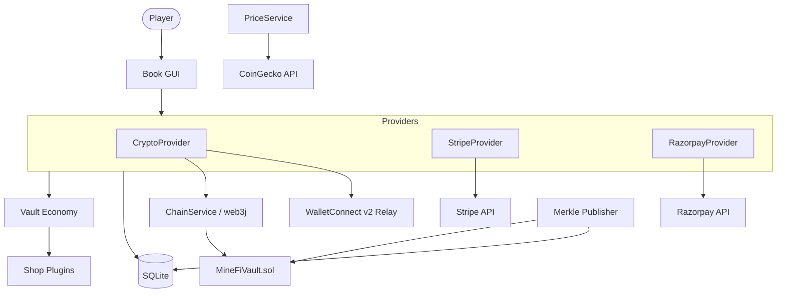
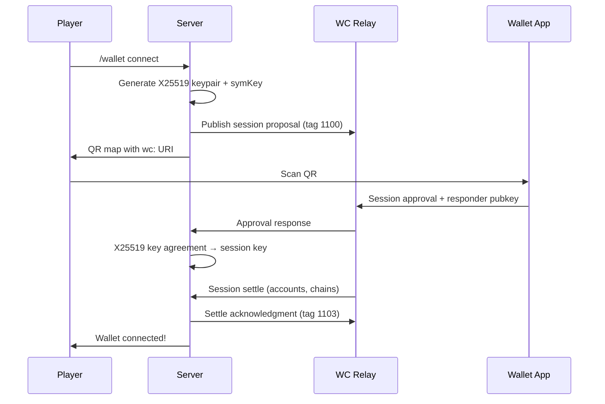
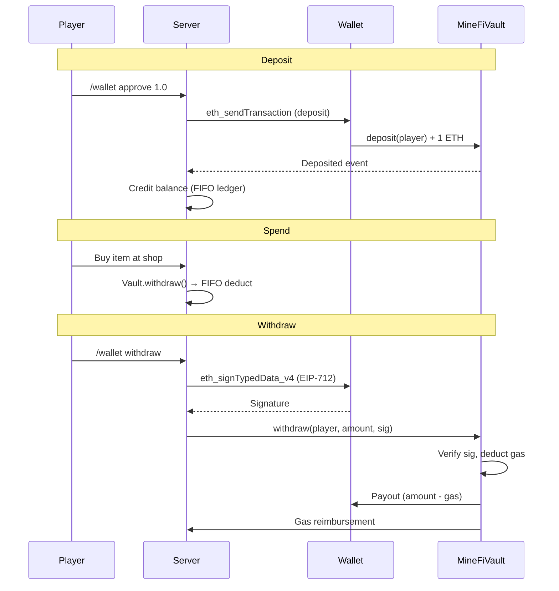

<h1 align="center">MineFi</h1>

<p align="center">
  Payment gateway for Minecraft.<br>
  Crypto, cards, UPI — plugs into Vault so your shops just work.
</p>

<p align="center">
  
  
  
  
  
</p>

<p align="center">
  
</p>

MineFi is a Spigot/Paper plugin that lets Minecraft players deposit and spend real money in-game. It connects crypto wallets via WalletConnect v2, accepts card and UPI payments through Stripe and Razorpay, and registers as a [Vault](https://github.com/MilkBowl/VaultAPI) economy provider so existing shop plugins work without changes.

Deposited funds are tracked in USD. The crypto side uses an on-chain escrow contract ([`MineFiVault.sol`](contracts/MineFiVault.sol)) with EIP-712 signed withdrawals and periodic Merkle root publishing — if the server disappears, players can still recover their on-chain funds.

<details>
<summary>Architecture overview</summary>



</details>

## Install

```bash
./gradlew shadowJar
cp build/libs/MineFi-0.1.0.jar /path/to/server/plugins/
```

Restart once to write `plugins/MineFi/config.yml`, fill in your keys, restart again.

## Features

**WalletConnect v2** — scan an in-game QR map to pair any wallet


<details>
<summary>Pairing sequence</summary>



</details>

**Stripe + Razorpay** — cards, UPI, easy to extend


**Crypto withdrawals** — player signs with their wallet, server relays on-chain


<details>
<summary>Deposit and withdrawal flow</summary>



</details>

**Transaction history** — every deposit and withdrawal tracked


**Vault economy** — every shop plugin keeps working, untouched

**Book GUI** — no commands to memorize

**Merkle root anchoring** — emergency withdraw if the server disappears

```mermaid
graph LR
    Server[Server publishes<br>Merkle root hourly] --> Contract[MineFiVault]

    subgraph Normal
        Player -->|withdraw + EIP-712 sig| Contract
    end

    subgraph Emergency
        Player2[Player] -->|emergencyWithdraw&#40;balance, proof&#41;| Contract
        Contract -->|Verify proof against root| Contract
        Contract -->|Wait 1hr dispute window| Contract
        Contract -->|Send min&#40;claimed, on-chain&#41;| Player2
    end
```

<details>
<summary>Emergency withdrawal path</summary>



</details>

**Live conversion** — ETH / INR ↔ USD via CoinGecko

## Techniques

- [X25519 key agreement](https://developer.mozilla.org/en-US/docs/Web/API/SubtleCrypto/deriveKey#ecdh) with HKDF derivation for WalletConnect session encryption — [`Crypto.kt`](src/main/kotlin/com/minefi/relay/Crypto.kt)
- [ChaCha20-Poly1305](https://developer.mozilla.org/en-US/docs/Web/API/SubtleCrypto/encrypt) AEAD encryption using a type-0 envelope format (type byte + 12-byte IV + ciphertext + auth tag)
- Ed25519 JWT authentication for the WalletConnect relay, with DID key encoding via base58btc multicodec — [`RelayAuth.kt`](src/main/kotlin/com/minefi/relay/RelayAuth.kt)
- [EIP-712 typed data signing](https://eips.ethereum.org/EIPS/eip-712) for withdrawal requests, verified on-chain by the escrow contract
- Keccak-256 Merkle tree with double-hashed leaves and canonical pair ordering — [`MerkleTree.kt`](src/main/kotlin/com/minefi/merkle/MerkleTree.kt)
- FIFO deposit ledger tracking remaining balance per deposit across providers — [`Database.kt`](src/main/kotlin/com/minefi/storage/Database.kt)
- QR-to-map rendering with error correction H and a pixel-art logo overlay — [`QrGenerator.kt`](src/main/kotlin/com/minefi/map/QrGenerator.kt)
- Exponential backoff with 60s ceiling for relay reconnection — [`RelayClient.kt`](src/main/kotlin/com/minefi/relay/RelayClient.kt)
- CompletableFuture bridges between the relay WebSocket and Bukkit scheduler threads

## Technologies

- [web3j](https://github.com/hyperledger/web3j) — EVM transaction signing and contract interaction
- [BouncyCastle](https://www.bouncycastle.org/java.html) — X25519, Ed25519, HKDF, ChaCha20-Poly1305, Keccak-256
- [ZXing](https://github.com/zxing/zxing) — QR code generation
- [OkHttp](https://square.github.io/okhttp/) — HTTP client and WebSocket for relay, Stripe, Razorpay, CoinGecko
- [OpenZeppelin Contracts](https://github.com/OpenZeppelin/openzeppelin-contracts) — EIP712, ECDSA, MerkleProof, Nonces in the escrow contract
- [Vault API](https://github.com/MilkBowl/VaultAPI) — economy provider interface for Minecraft shop plugins
- [SQLite (xerial)](https://github.com/xerial/sqlite-jdbc) — persistent storage for balances, sessions, deposits, transactions
- [Silkscreen](https://fonts.google.com/specimen/Silkscreen) — landing page pixel font via Google Fonts
- [Minecraft font](site/minecraft.woff2) — custom WOFF2 for the landing page title

## Project Structure

```
MineFi/
├── contracts/
├── docs/
│   └── media/
├── site/
├── src/
│   ├── main/
│   │   ├── kotlin/com/minefi/
│   │   │   ├── chain/
│   │   │   ├── commands/
│   │   │   ├── gui/
│   │   │   ├── listeners/
│   │   │   ├── map/
│   │   │   ├── merkle/
│   │   │   ├── price/
│   │   │   ├── provider/
│   │   │   ├── relay/
│   │   │   ├── storage/
│   │   │   └── vault/
│   │   └── resources/
│   └── test/
├── build.gradle.kts
└── settings.gradle.kts
```

- **`contracts/`** — Solidity escrow contract, deployable to any EVM chain
- **`site/`** — Static landing page and payment redirect pages, deployed to Cloudflare Pages
- **`chain/`** — web3j RPC calls, transaction signing, contract interaction
- **`relay/`** — WalletConnect v2 protocol: WebSocket client, session management, encryption
- **`merkle/`** — Merkle tree construction and proof generation for on-chain balance anchoring
- **`provider/`** — Payment provider implementations behind a common interface
- **`map/`** — QR code and receipt rendering on Minecraft maps
- **`gui/`** — Book-based in-game menu with clickable buttons
- **`vault/`** — Vault economy provider that bridges MineFi balances to shop plugins

## Commands

```
/wallet                             open the book
/wallet connect                     QR to link a wallet
/wallet approve <amount>            deposit ETH
/wallet withdraw <chain> <amount>   withdraw crypto
/wallet verify                      check balance against Merkle root
/wallet history                     recent transactions
```

Full list in [`docs/CONFIGURATION.md`](docs/CONFIGURATION.md).

## Docs

| | |
|---|---|
| [Features](docs/FEATURES.md) | What it does, for server owners |
| [Configuration](docs/CONFIGURATION.md) | `config.yml` + every command |
| [Redirect pages](docs/REDIRECT_PAGES.md) | Hosting Stripe/Razorpay success pages |
| [Providers](docs/PROVIDERS.md) | Writing a new payment provider |
| [Contract](docs/CONTRACT.md) | `MineFiVault.sol` reference |
| [Architecture](docs/ARCHITECTURE.md) | How the pieces fit |

## Requirements

Spigot/Paper 1.20+ · Java 17 · Vault · WalletConnect project ID · Stripe/Razorpay keys

## License

MIT
