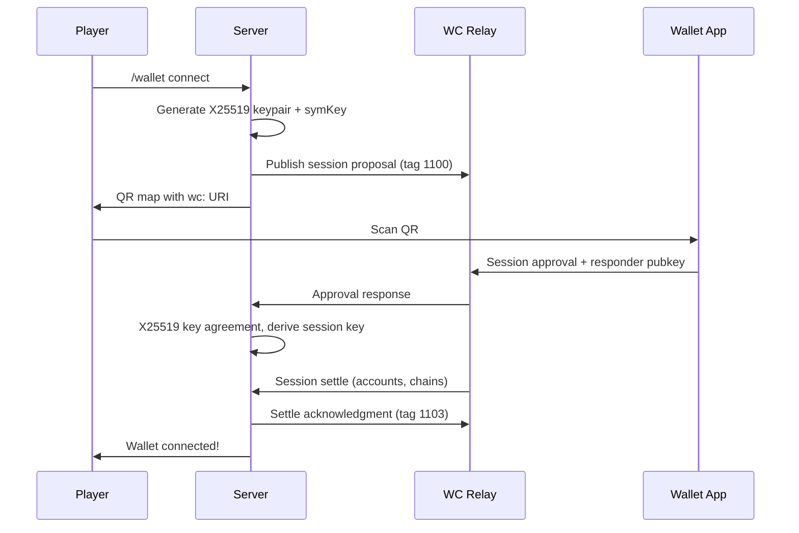

<div align="center">

<picture>
  <source media="(prefers-color-scheme: dark)" srcset="docs/media/logo-dark.png">
  <source media="(prefers-color-scheme: light)" srcset="docs/media/logo.png">
  
</picture>

<br><br>

Payment gateway plugin for Minecraft servers.
Crypto, cards, and UPI through one plugin that plugs into Vault.

<br>

<a href="https://minefi.pages.dev">Website</a>&nbsp;&nbsp;&bull;&nbsp;&nbsp;<a href="docs/CONFIGURATION.md">Configuration</a>&nbsp;&nbsp;&bull;&nbsp;&nbsp;<a href="docs/FEATURES.md">Features</a>&nbsp;&nbsp;&bull;&nbsp;&nbsp;<a href="docs/CONTRACT.md">Contract</a>

<br>


<br><br>


</div>

## About

MineFi lets players deposit and spend real money in-game. It connects crypto wallets via WalletConnect v2, accepts card and UPI payments through Stripe and Razorpay, and registers as a [Vault](https://github.com/MilkBowl/VaultAPI) economy provider so existing shop plugins work without changes.

Deposited funds are tracked in USD. The crypto side uses an on-chain escrow contract ([`MineFiVault.sol`](contracts/MineFiVault.sol)) with EIP-712 signed withdrawals and periodic Merkle root publishing. If the server disappears, players can recover their on-chain funds directly from the contract.

## Features

**WalletConnect v2** &mdash; scan an in-game QR map to pair any wallet


**Stripe + Razorpay** &mdash; cards, UPI, easy to extend


**Crypto withdrawals** &mdash; player signs with their wallet, server relays on-chain


**Transaction history** &mdash; every deposit and withdrawal tracked


**Vault economy** &mdash; every shop plugin keeps working, untouched

**Book GUI** &mdash; no commands to memorize

**Merkle root anchoring** &mdash; emergency withdraw if the server disappears

**Live conversion** &mdash; ETH / INR / USD via CoinGecko

<details>
<summary>Architecture</summary>


</details>

<details>
<summary>WalletConnect pairing sequence</summary>



</details>

<details>
<summary>Deposit and withdrawal flow</summary>


</details>

## Commands

```
/wallet                             open the book
/wallet connect                     QR to link a wallet
/wallet approve <amount>            deposit ETH
/wallet withdraw <chain> <amount>   withdraw crypto
/wallet verify                      check balance against Merkle root
/wallet history                     recent transactions
```

Full reference in [`docs/CONFIGURATION.md`](docs/CONFIGURATION.md).

## Requirements

* Spigot or Paper 1.20+
* Java 17+
* [Vault](https://github.com/MilkBowl/VaultAPI) (for economy integration)
* [WalletConnect Cloud](https://cloud.walletconnect.com) project ID (for crypto)
* Stripe and/or Razorpay keys (for cards/UPI)

## Building

```bash
./gradlew shadowJar
cp build/libs/MineFi-0.1.0.jar /path/to/server/plugins/
```

Restart once to write `plugins/MineFi/config.yml`, fill in your keys, restart again.

## Project Structure

```
MineFi/
├── contracts/
├── docs/
│   └── media/
├── site/
├── src/
│   ├── main/kotlin/com/minefi/
│   │   ├── chain/
│   │   ├── commands/
│   │   ├── gui/
│   │   ├── listeners/
│   │   ├── map/
│   │   ├── merkle/
│   │   ├── price/
│   │   ├── provider/
│   │   ├── relay/
│   │   ├── storage/
│   │   └── vault/
│   └── test/
├── build.gradle.kts
└── settings.gradle.kts
```

| Directory | What it does |
|---|---|
| [`contracts/`](contracts/) | Solidity escrow contract, deployable to any EVM chain |
| [`site/`](site/) | Landing page and payment redirect pages (Cloudflare Pages) |
| [`relay/`](src/main/kotlin/com/minefi/relay/) | WalletConnect v2: WebSocket, session management, [X25519](https://developer.mozilla.org/en-US/docs/Web/API/SubtleCrypto/deriveKey#ecdh) + [ChaCha20-Poly1305](https://developer.mozilla.org/en-US/docs/Web/API/SubtleCrypto/encrypt) encryption |
| [`merkle/`](src/main/kotlin/com/minefi/merkle/) | Keccak-256 Merkle tree for on-chain balance proofs |
| [`provider/`](src/main/kotlin/com/minefi/provider/) | Payment providers (crypto, Stripe, Razorpay) behind a common interface |
| [`map/`](src/main/kotlin/com/minefi/map/) | QR code and receipt rendering on Minecraft maps |
| [`gui/`](src/main/kotlin/com/minefi/gui/) | Book-based in-game menu with clickable buttons |
| [`vault/`](src/main/kotlin/com/minefi/vault/) | Vault economy bridge |
| [`chain/`](src/main/kotlin/com/minefi/chain/) | [web3j](https://github.com/hyperledger/web3j) RPC, transaction signing, contract calls |

## Technologies

| Library | Used for |
|---|---|
| [web3j](https://github.com/hyperledger/web3j) | EVM transaction signing, contract interaction |
| [BouncyCastle](https://www.bouncycastle.org/java.html) | X25519, Ed25519, HKDF, ChaCha20-Poly1305, Keccak-256 |
| [ZXing](https://github.com/zxing/zxing) | QR code generation |
| [OkHttp](https://square.github.io/okhttp/) | HTTP + WebSocket for relay, Stripe, Razorpay, CoinGecko |
| [OpenZeppelin](https://github.com/OpenZeppelin/openzeppelin-contracts) | [EIP712](https://eips.ethereum.org/EIPS/eip-712), ECDSA, MerkleProof, Nonces |
| [Vault API](https://github.com/MilkBowl/VaultAPI) | Economy provider interface |
| [SQLite (xerial)](https://github.com/xerial/sqlite-jdbc) | Balances, sessions, deposits, transactions |
| [Silkscreen](https://fonts.google.com/specimen/Silkscreen) | Landing page pixel font |

## Documentation

| | |
|---|---|
| [Features](docs/FEATURES.md) | What it does, for server owners |
| [Configuration](docs/CONFIGURATION.md) | `config.yml` reference and every command |
| [Redirect pages](docs/REDIRECT_PAGES.md) | Hosting Stripe/Razorpay success pages |
| [Providers](docs/PROVIDERS.md) | Writing a new payment provider |
| [Contract](docs/CONTRACT.md) | `MineFiVault.sol` reference |
| [Architecture](docs/ARCHITECTURE.md) | How the pieces fit |

## License

[MIT](LICENSE)
